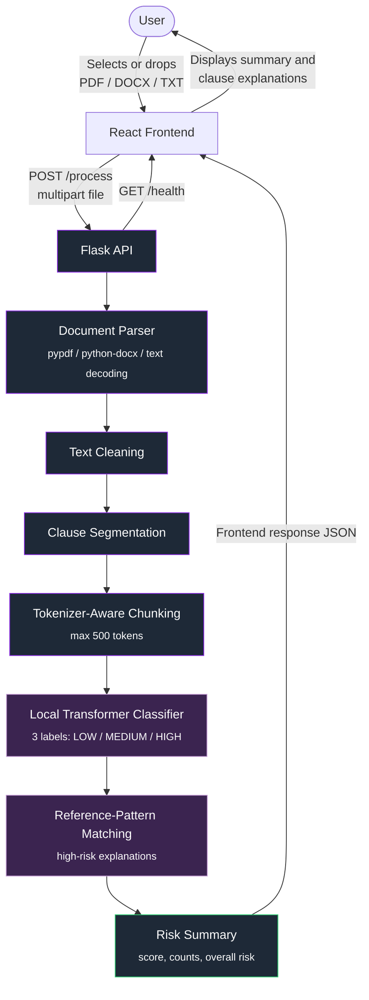

# 📄 Saral Docs

**AI-powered clause-level risk analysis for Indian legal documents.**

Saral Docs helps non-lawyers understand what they're signing. Upload a contract, lease, or agreement — the system extracts text, segments it into clauses, and uses a fine-tuned **Legal-BERT** model to flag risky language clause-by-clause, with an overall document risk score.


---

## Table of Contents

- [Why Saral Docs](#why-saral-docs)
- [Architecture](#architecture)
- [Features](#features)
- [Tech Stack](#tech-stack)
- [Project Structure](#project-structure)
- [Getting Started](#getting-started)
- [Model Setup](#model-setup)
- [Running the App](#running-the-app)
- [Supported Files](#supported-files)
- [API Overview](#api-overview)
- [Screenshots](#screenshots)
- [Roadmap](#roadmap)
- [Disclaimer](#disclaimer)

---

## Why Saral Docs

Legal documents are written for lawyers, not for the people signing them. Most people accept terms they don't fully understand because reading a 12-page lease clause-by-clause isn't realistic. Saral Docs closes that gap: it reads the document the way a legal analyst would, and surfaces *which specific clauses* carry risk and *how much*, instead of a vague "read carefully" warning.

## Architecture
 


**Flow summary:**
1. User selects or drops a document (PDF / DOCX / TXT, up to 25 MB) in the React UI.
2. The frontend sends the file directly to the Flask API with `POST /process`.
3. The backend extracts and cleans text, then segments it into clauses.
4. Long clauses are split into tokenizer-aware chunks before local transformer inference.
5. The backend assigns LOW, MEDIUM, or HIGH probabilities to each analysis unit, adds matched explanations for high-risk patterns, and aggregates the results.
6. The API returns one JSON response containing the document summary and clause-level results; the frontend renders the report.

## Features

| Feature | Description |
|---|---|
| 📤 Document Upload | Drag-and-drop upload for PDF, DOCX, and TXT files |
| 🔍 Text Extraction | Robust parsing across supported formats |
| ✂️ Clause Segmentation | Splits documents into individually analyzable clauses |
| ⚖️ Clause-Wise Risk Classification | Legal-BERT scores each clause independently |
| 🚦 Risk Levels | Low / Medium / High per clause |
| 📊 Overall Risk Assessment | Aggregated document-level risk score |
| 🖥️ React UI | Clean upload-and-review workflow |
| ⚙️ Flask API | Lightweight backend serving the ML pipeline |

## Tech Stack

- **Backend:** Python, Flask, Legal-BERT (transformers)
- **Frontend:** React
- **Model format:** `safetensors`
- **Supported inputs:** PDF, DOCX, TXT

## Project Structure

```
SaralDocs/
├── backend/          # Flask API, document parser, risk pipeline
│   └── model/        # Legal-BERT model files (downloaded separately)
├── frontend/         # React UI
├── Other/            # Legacy Streamlit prototype, kept for reference
├── start-backend.ps1
├── start-frontend.ps1
└── README.md
```

## Model Download

The trained Legal-BERT risk model is not included in this repository because the model file exceeds GitHub's 100 MB file size limit.

Download the trained model from Google Drive:

**[Download Saral Docs Legal-BERT Model](YOUR_GOOGLE_DRIVE_LINK)**

After downloading, place the model file at:

```text
backend/model/model.safetensors
```

The backend requires this model file to perform clause-level risk classification.

> Make sure the Google Drive file is shared as **Anyone with the link → Viewer** so that users can access it.

## Requirements

Before running the project, make sure you have:

* Python 3.x
* Node.js and npm
* Git

### Clone the repository

```bash
git clone https://github.com/Luqman2025/SaralDocs.git
cd SaralDocs
```

## Model Setup

The trained Legal-BERT risk model is **not included** in this repository — it exceeds GitHub's 100 MB file size limit.

1. **[Download the Saral Docs Legal-BERT model](https://drive.google.com/file/d/1XrYl_tiavXiU-jkV-1M8f40A3YDvrhwJ/view?usp=drive_link)**
2. Place the file at:
   ```
   backend/model/model.safetensors
   ```

> The backend will not run correctly without this file in place.

## Running the App

### Backend

```bash
cd backend
pip install -r requirements.txt
python app.py
```
Runs at: `http://localhost:8000`

### Frontend

```bash
cd frontend
npm install
npm start
```
Runs at: `http://localhost:3000`

## Supported Files

| Format | Max Size |
|---|---|
| PDF  | 25 MB |
| DOCX | 25 MB |
| TXT  | 25 MB |

## API Overview

| Endpoint | Method | Description |
|---|---|---|
| `/process` | `POST` | Accept a `multipart/form-data` upload under the `file` field and return the complete risk report |
| `/health` | `GET` | Return API status and whether the required local model files are present |

The `/process` response includes the file name, document type, overall risk, risk score, risk counts, number of analyzed clauses, and `legal_context` entries with the original clause, predicted risk, confidence, probabilities, type, and explanation.

## Screenshots

The screenshots below show the implemented upload and clause-analysis workflow.

### Upload and Preview


### Analysis Results


## Disclaimer

Saral Docs is an **academic AI/ML prototype** built for educational purposes. It highlights *possible* risk patterns based on a trained machine learning model. It does **not** provide legal advice and should not replace guidance from a qualified legal professional.